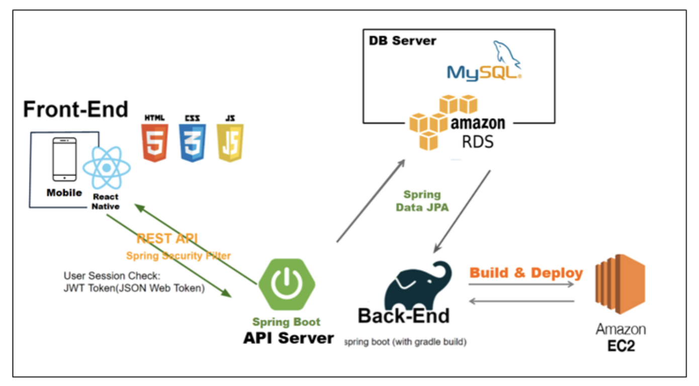
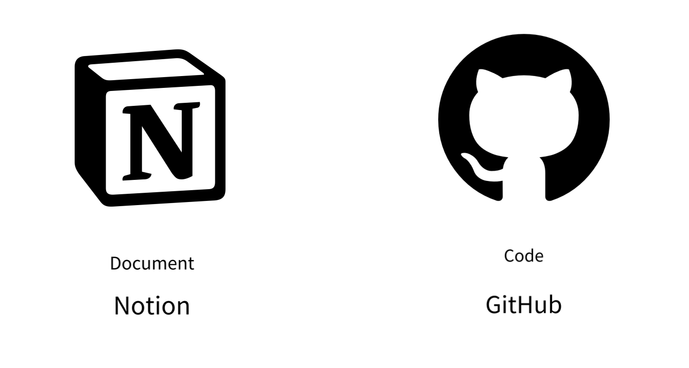
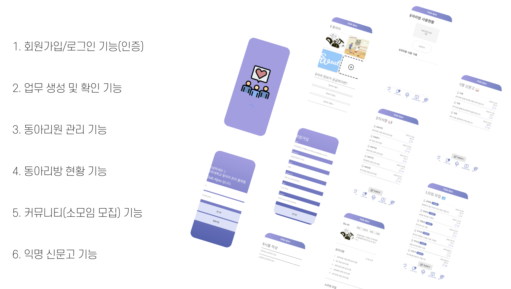

# Mo-Ajou

> 교내 동아리 활동 체계화를 위한 동아리 운영 플랫폼 👥

## 프로젝트 소개 📝

**아주대학교 교내 동아리 정보**를 한눈에 볼 수 있어요 !

동아리 활동 및 동아리원를 체계적으로 관리할 수 있어요 !

**동아리방 현황 및 출입기록**을 확인할 수 있어요 !

 

## 프로젝트 제작 동기 🔭

1. 교내 동아리 정보 제공
2. 동아리 관리 체계화
3. 동아리방 사용 현황 및 출입 기록 로깅

 

## 아키텍처 ⭐️

 

## 협업 툴 🧑🏻‍💻

 

## 프로젝트 기능 & 페이지 구성 📱

